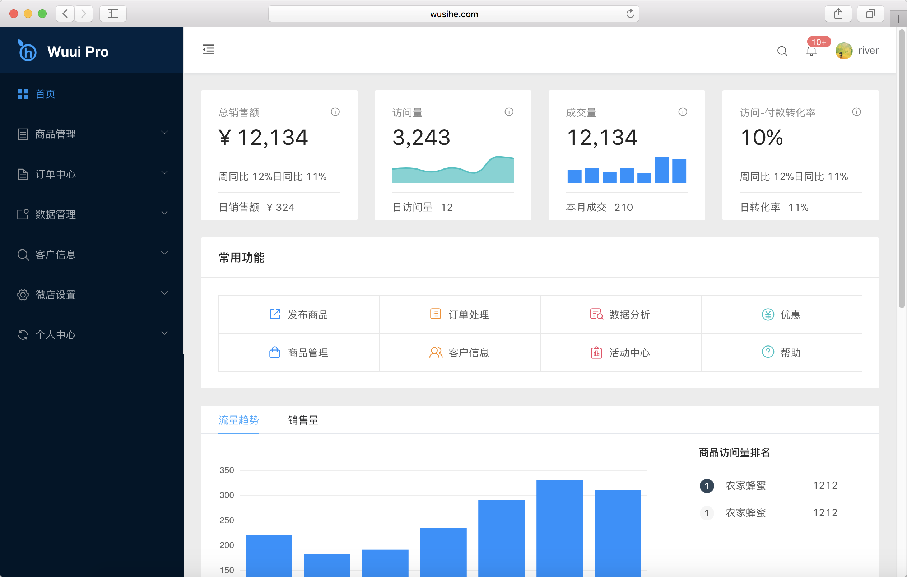

<h1 align="center">Wuui Pro</h1>

<div align="center">
基于真实案例的中台前端/设计解决方案。



</div>


[中文文档](https://wuui.top/#/pro/start)

### 技术栈

vue + echart + element-ui + axios + webpack + ES6/7 + pug + stylus


### 项目运行

#### 注意：由于涉及到 ES6 等新属性，建议使用 node 最新稳定版

```
git clone https://github.com/wsihe/wuui-pro.git

cd wuui-pro

npm install

npm run serve

```

### 功能

- 登录/登出
- 收缩侧栏
- 标签导航

- 首页总览
- 商品管理
- 订单中心
- 数据管理
- 客户信息
- 店铺设置
- 个人中心


### 说明

>  如果对您有帮助，您可以点右上角 "Star" 你的支持就是我的动力 谢谢！ ^_^

>  如有问题请直接在 Issues 中提，或者你有更好的解决方案，欢迎 PR
```